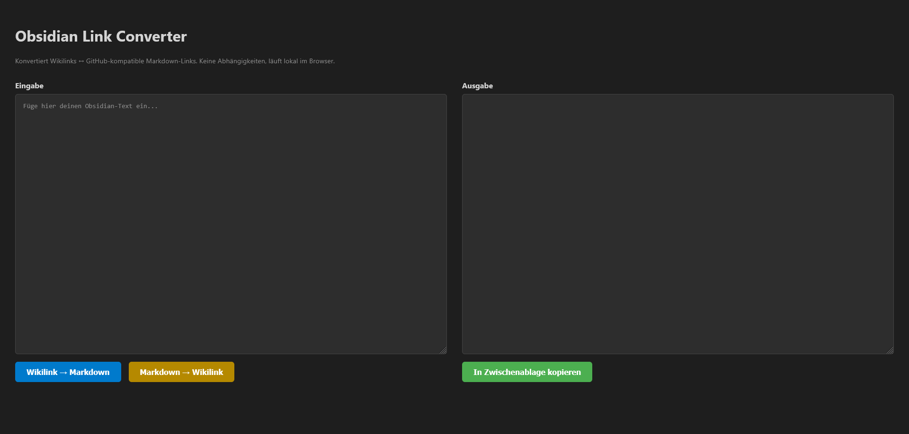

# Obsidian Link Converter

Ein schlanker, dependency-freier Browser-Tool zum Konvertieren zwischen Obsidian-Wikilinks und GitHub-kompatiblen Markdown-Links — und zurück.



## Warum?

Obsidian nutzt `[[Wikilinks]]` und interne Anker im Format `[[#Überschrift]]`. Diese Links sind in anderen Markdown-Umgebungen (GitHub, GitLab, VS Code, Pandoc) nicht klickbar. Dieses Tool konvertiert beides hin und her, ohne dabei Code-Blöcke, Bilder oder externe URLs zu zerstören.

## Features

- **Wikilink → Markdown**: Konvertiert `[[Seitenname]]`, `[[Seite#Abschnitt]]`, `[[Seite|Alias]]` und `![[Bild.png]]` zu GitHub-kompatiblen Links
- **Markdown → Wikilink**: Rückkonvertierung von Standard-Markdown-Links zu Wikilinks
- **Code-Block-Schutz**: Inhalte in ` ``` `-Blöcken und Inline-Code bleiben unberührt
- **Embed-Erkennung**: `![[bild.png]]` → `` — kein fehlerhaftes `.md`-Suffix bei Anhängen
- **Anhang-Whitelist**: Bekannte Dateiendungen (PNG, JPG, SVG, PDF, MP4, …) werden korrekt behandelt
- **GitHub-kompatibler Slug**: Anker werden nach GitHub Flavored Markdown-Standard erzeugt
- **Duplikat-Erkennung**: Bei doppelten Überschriften in einer Datei erscheint eine Warnung
- **Alias-Intelligenz**: Unnötige `[[Ziel|Ziel]]`-Pipes werden bei der Rückkonvertierung vermieden
- **Keine Abhängigkeiten**: Eine einzige HTML-Datei, läuft komplett lokal im Browser

## Verwendung

```
index.html im Browser öffnen — fertig.
```

Kein Server, kein Build-Schritt, kein npm.

## Bekannte Einschränkungen

- **Duplikat-Überschriften**: Bei zwei Überschriften mit gleichem Namen kann der Konverter nicht wissen, auf welche ein `[[#Überschrift]]`-Link zeigt. Der erste Treffer wird verwendet; eine Warnung wird angezeigt.
- **Emoji in Überschriften**: Werden entfernt. GitHub behält manche Unicode-Zeichen — für rein deutschen/englischen Text kein Problem.
- **Vault-übergreifende Links**: Relative Pfade werden 1:1 übernommen; Obsidians Shortest-Path-Auflösung wird nicht simuliert.

## Lizenz

MIT
